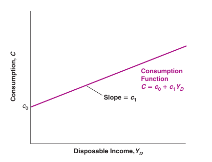

*Disclaimer: these notes are almost entirely based on Olivier Blanchard's Macroeconomics and the graphs were extracted from it. I also used Robert J. Barro's Intermediate Macroeconomics and [Liam Malloy's lectures](https://youtube.com/playlist?list=PL0hztMsyncWNY4vgrdUA02n9JybQb36AP).*

# 1. What is Macroeconomics?

Why are jobs abundant at some point in time and then scarce? What raises prices over the time?

Macroeconomics concerns itself with the behaviour of the economy as a whole.

Can and should the government intervene in the economy in order to better its performance?

Three models: long, medium and short run.

## Long run

Is called the Economical Growth theory, which studies the capacity of economical growth to produce goods and services.

How the accumulation of capital and technological improvements lead to an improvement of the living standards?

In the long run, recessions, expansions, fluctuations are ignored. We assume that the capital is totally employed.

This is possible because fluctuations converge to an average over the years. What matters is the mean growth of the economy.

What are the causes of economical growth and the difference in the growth between the nations? In industrialized countries, the development of technologies and accumulation of capital are primary. In developing countries, of a good functioning infrastructure. And everywhere, the savings rate is a determining factor of future well-being.

## Medium run

The capital and technological levels are fixed, with only temporary shocks. This fixed capital and technological level defines the **potential product** of the economy.

In the medium run, the goods and services supply is equal to the potential product. Prices and inflation are determined by the fluctuations on the demand. 

Here, the product level is given by the supply side, the productive capacity of the economy. And the price level is given by the demand in relation to the product that the economy can offer.

Aggregated supply (AS):
: For each given price level, shows the quantity of product that the firms are willing to supply. Depends on the productive capacity of the economy.

Aggregated demand (AD):
: Gor each given price level, shows the level of product at which the goods market and moneraty markets are simultaneosly in equilibrium. Depends the monetary and fiscal policy and the level of consumer's trust.

The intersection between both AS and AD curves gives the price and quantity.

In the medium run, the AS curve is vertical. The product is the position at which this curve crosses the horizontal axis. 

The product is determined only by the aggregated supply. And the prices are determined by both aggregated supply and aggregated demand.

High inflation rates happens because of changes in the aggregated demand since the change in the AS is always small, but the change in AD can be large or small. In fact, high inflation rates result from the raise in the currency supply.

## Short run

Fluctuation on the demand determine how much capacity is used and, hence, the levels of product and unemployment.

Here, prices are relatively fixed and product varies. I.e., the AS curve is horizontal. The product level does not affect the prices.

Macroeconomic policy has its major role in the short run.

The product is determined only by the aggregated demand. And the prices are not affected by the product levels.

## The transition between short and medium runs

What happens in between the short and medium runs?

A high aggregated demand elevates the product, the firms raises the prices and the AS curve starts moving upwards.

The speed at which the prices are adjusted is summarized in the Phillips curve, which relates inflation and unemployment.

## Growth and GDP

Growth rate:
: The economical growth theory is the rate at which the GDP grows.

What makes the GDP grow?

1. The work force and and the capital grows with time. 

2. The efficiency of the production factors can change. I.e., we can have raises in productivity.

## Economical cycle and Product hiatus

Economical cycle:
: The pattern of expansion or contraction of the economical activity around the growth tendency line.

Product hiatus:
: Is the deviation of the product in relation to the tendency line. Is the difference between the real product and what the economy could product in full employment of its full resources.
: Product hiatus $=$ real product $-$ potential product.

During a recession, the real product is below the potential product.

Inflation is directly related to the product hiatus. Expansionist policies of aggregated demand tend to generate inflation, except when the unemployment rate is high.

Also, inflation reduces the efficiency of the pricing system.

# 2. Macroeconomic Data

## Gross Domestic Product

The most important economic indicator is the GDP, which is used to measure the standard of living.

Gross Domestic Product (GDP):
: Is the current value of all final goods and services that are produced within a country in a given period of time. If $n$ is the total number of final goods and services, $p_{i,t}$ is the price and $y_{i,t}$ is the quatity of the good $i$ at time $t$, then $$ \text{GDP}_t = p_{1,t} y_{1,t} + \ldots + p_{n, t} y_{n,t} = \sum_{i=1}^n p_{i,t} y_{i,t} $$

Notice that the total production must be equal to total income.

Another way of understanding the GDP is the ``expenditure'' approach. Let $C$ denote the consumption, $I$ the investment, $G$ the government expenditure, $NX$ be the net exports, which is the exports $X$ minus the imports $IM$. I.e.,
$$ \text{GDP}_t = C_t + I_t + G_t + (X_t - {IM}_t) $$

Four board actors in an aggregate economy: households (consumption), firms (investments), government (expenditure) and the rest of the world (net exports). In this way, the total GDP is the sum of the expenditure by the different actors in the economy.

## Real vs. Nominal

Removing the influence of prince changes over time, to really measure the production, we obtain the *real GDP*. 

Real prices are in unit of good, whereas nominal prices are in units of money. Since the nominal price is the amount of goods $y$ times the price of each unit $p$, we have
$$ \text{Real} = \frac{\text{Nominal}}{\text{Price}} = \frac{py}{p} = y $$

If we have two goods, the relative price between $y_1$ and $y_2$ is the ration of nominal prices
$$ \frac{p_1}{p_2} = \frac{\text{dollars per unit of good 1}}{\text{Dollar per unit of good 2}} = \frac{\text{good 2}}{\text{good 1}} $$

And then we define the real output in two ways, either in units of good 1 or units of good 2:
$$ \text{Real}_1 = y_1 + \frac{p_2}{p_1}y_2 $$
$$ \text{Real}_2 = \frac{p_1}{p_2} y_1 + y_2 $$

To simplify, we use dollars instead of units of one particular good and pick a year as a baseline. Then, the real GDp in the year $t + s$ is equal to the sum of quantities of stuff produced in year $t + s$ weighted by the prices from year $y$.
$$ Y_{t+s} = \sum_{i=1}^n p_{i,t} y_{i, t+s} $$

From this, it is possible to define an *implicit price index* as the ratio of nominal to real GDP in a given year.
$$ P_{t+s} = \frac{\sum_{i=1}^n p_{i,t+s} y_{i, t+s}}{\sum_{i=1}^n p_{i,t} y_{i, t+s}} $$

However, in this approach the base year is arbitrary. 

## The Unemployment Rate

Labor Force:
: The number of people who want to work, i.e., the labor force ($L$) equals the employment ($N$) plus the unemployment ($U$).
$$ L = N + U $$

Unemployment rate:
: The percentage of people who would like to be working, but are not working.
$$ u = \frac{U}{L} $$

How to measure it? In U.S., there's the **Current Population Survey (CPS)**. 

Not everyone not working is counted as unemployed.

**Discourage workers** are those who give up looking for a job and no longer count as unemployed.

The **participation rate** is the ratio of the labor force to the total population of working age.

### Why care about unemployment?

1. Effect on the welfare of the unemployed (e.g. effects on happiness).

2. Signal that the economy is not using its human resources efficiently.

3. Very low unemployment can be a problem as the economy runs into labor shortages. 

## The Inflation Rate

What is inflation?

Inflation:
: Sustained rise in the general level of prices--the **price level**. The **inflation rate** is the rate at which the prive level increases. **Deflation** is a sustained decline in the price level. 

Two measures of the price level: the **GDP deflator** and the **Consumer Price Index**.

### GDP Deflator

GDP deflator:
: The **GDP deflator**, also called an **index number**, in year $t$, denoted by $P_t$ is the ratio of nominal GDP to real GDP in the year $t$.
$$ P_t = \frac{\text{Nominal GDP}_t}{\text{Real GDP}_t} = \frac{\$ Y_t}{Y_t} $$

The rate of change shows the rate of inflation.
$$ \pi_t = \frac{P_t - P_{t-1}}{P_{t-1}} $$

In other words, if the nominal GDP increases faster than the GDP, the difference must come from an increase in prices.

### The Consumer Price Index

The idea is to measure the **cost of living**, which is not captured by the GDP deflator.

The CPI is published monthly, collects price data for 211 items in 38 cities.

The CPI and the GDP deflator move together most of the time, usually differing by lass than 1%.

### Why care about inflation?

Pure inflation:
: Proportional increase in all prices and wages. In this case, the real wage would be unaffected. But there is no such thing as pure inflation.

1. Inflation affects income distribution. Not all prices and wages rise proportionately.

2. Leads to distortions due to uncertainty, making it hard to make decisions such as investment decisions.

What is the `best' rate of inflation? Most macroeconomists believe in a low and stable rate between 1% and 4%.

## Okun's Law

Okun's Law:
: If the output growth is high, unemployment will decrease. This relationship is linear with a slope of $-0.3$ (an increase in the growth rate of 1% decreases the unemployment rate by roughly $0.3$%) and crosses the horizontal axis where the annual output growth is $2$% (it takes a growth rate of $2$% to keep unemployment constant).

## The Phillips Curve

When unemployment is very low, there's an upward pressure on inflation.

Phillips plotted the rate of inflation against the unemployment rate.

The line is downward sloping: higher unemployment leads to a decrease in inflation. Crosses the horizontal axis where the unemployment is about $6$%: the inflation typically increased when unemployment was below $6$%.

# 3. The Goods Market

In the following chapters, we'll focus on the short run. In the year-to-year movements in economic activity, we need to study the interactions among production, income, and demand.

Changes in demand for goods lead to changes in production.

Changes in production lead to changes in income.

Changes in income lead to changes in the demand for goods.

## The Composition of GDP

As we saw, the GDP is composed of consumption ($C$), investment ($I$), government spending ($G$), exports ($X$) and imports ($IM$). And net exports (or trade balance) is simply $X - IM$. 

## The Demand for Goods

The total demand for goods $Z$ is equal to consupmtion, plus investment, plus government, plus exports, minus imports.
$$ Z := C + I + G + X - IM $$

In a closed economy, $X = IM = 0$. Hence,
$$ Z = C + I + G $$

### Modelling Consumption

Consumption $C$ is a function of disposable income $Y_D$, which is the income $Y$ that remains after consumers have received government transfers and paid their taxes. Denoting by $T$ taxes minus government transfers, we have 
$$ Y_D = Y - T $$

The function $C(Y_D)$ is called the **consumption function**. This is a **behavioral equation** that captures the behavior of consumers.

We'll assume that the consumption function is a linear relation
$$ C = c_0 + c_1 Y_D $$
where $c_1$ is the **propensity to consume** and $c_0$ is what people would consume if their disposable income equals zero (people still need to eat!).

### Modelling Investment

Endogenous variables:
: Variables that depend on other variables in the model.

Exogenous variables:
: Variables not explained within the model but is taken as given.

We'll use a bar to denote taken as a given and assume $I = \bar{I}$.

### Modelling Government Spending

$T$ and $G$ describe a **fiscal policy**, the choice of taxes and spending by the government. 

These variables are exogenous because governments do not behave with the same regularity as consumer or firms. We'll treat $T$ and $G$ as variables chosen by the government and will not try to explain them within the model.

### Equilibrium in the Goods Market

We assumed $X = IM = 0$, so
$$ Z = C + I + G$$

Replacing $C$ and $I$ obtained:
$$ Z = c_0 + c_1 (Y - T) + \bar{I} + G $$

The **equilibrium in the goods market** requires
$$ Y = Z $$
which is an **equilibrium condition**.

Hence, 
$$ Y = c_0 + c_1 Y - c_1 T + \bar{I} + G $$

Moving $c_1 Y$ to the left-hand side:
$$ (1 - c_1) Y = c_0 - c_1 T + \bar{I} + G $$

Dividing both sides by $(1 - c_1)$:
$$ Y = \frac{1}{1 - c_1} (c_0 + \bar{I} + G - c_1 T) $$
which characterizes the equilibrium output.

The term $(c_0 + \bar{I} + G - c_1 T)$ is the part of the demand for goods that does not depend on output. Thus it is called **autonomous spending**. 

Notice that $c_0, I > 0$. Moreover, if the government runs a **balanced budget** (i.e. $T = G$) and $0 < c_1 < 1$, then $(G - c_1 T)$ is positive.

Therefore, the autonomous spending is only negative when the government is running a very large budget surplus (taxes much larger than government spending). We'll ignore this case.

The term $\frac{1}{1 - c_1}$ is the **multiplier**, which is larger when $c_1$ is closer to $1$.

Example: if $c_1 = 0.6$, then the multiplier equals $1/(1-0.6) = 1/0.4 = 2.5$, which means than an increase of consumption by $1 billion will increase output by $2.5 billion.

Plotting the production as a function of income and noticing that since production equals income, their relation is the 45-degree line, the equilibrium is the intersection of the both graphs.

If we have a shift up in autonomous consumption (say $1 billion, as in the previous example), we have a more than one-for-one effect on equilibrium output.

We have a sequence of increases in production, income and demand. After $n+1$ rounds:
$$ 1 + c_1 + c_1^2 + \ldots + c_1^n $$
which is a geometric series ($|c_1| < 1$) that converges to $1/(1-c_1)$. 

Summarizing,

- Production depends on demand, which depends on income, which is itself equal to production.

- An increase in demand leads to an increase in production and income, which leads to a further increase in demand.

- The end result is an increase in output that is larger than the initial shift in demand by a factor equal to the multiplier.

- The multiplier depends on the propensity to consume, which can be estimated using econometrics.

## The IS Interpretation

Keynes articulated an alternative model that focuses on investment and saving. 

Private saving:
: The disposable income minus their consumption, denoted by $S$.
$$ S := Y_D - C = Y - T - C$$

Public saving:
: Taxes (net of transfers) minus government spending: $T - G$. If public saving is greater then zero, we have **budget surplus**. If it is negative, we have **budget deficit**.

In equilibrium:
$$ Y = C + I + G $$

Subtracting $T$ from both sides and moving $C$ to the left side:
$$ Y - T - C = I + G - T $$

Since $S = Y - T - C$, we have
$$ S = I + G - T $$

I.e.,
$$ I = S + (T - G) $$

This is the **IS relation**, which stands for `Investment equals Saving'.

Now we have two equivalent ways of stating the condition for equilibrium in the goods market:
$$ \text{Production } = \text{ Demand} $$
$$ \text{Investment } = \text{ Saving} $$

Using the consumption behavior we studied,
$$ S = Y - T - C = Y - T - c_0 - c_1(Y - T)$$

Rearranging,
$$ S = - c_0 + (1-c_1) (Y-T) $$

And the term $1-c_1$ is called the **propensity to save**, which is between zero and one.

In equilibrium, $I = S$, and hence
$$ I = - c_0 + (1-c_1) (Y-T) + (T - G)$$

Solving for output:
$$ Y = \frac{1}{1 - c_1} (c_0 + \bar{I} + G - c_1 T) $$
as we had before.

The paradox of saving: if consumers decide to save more, $c_0$ decreases, which implies that the output decreases. However savings cannot change because of the IS identity.

# 4. Financial Markets

In this section, we focus on the role of the central bank in affecting interest rates.

Suppose that you have a choice between only two assets: money and bonds. And two types of money: currency and checkable deposits.

While money is used for transaction, with no interest, bonds pay a positive interest rate $i$ (called the **rate of interest**), but cannot be used for transaction.

## The Demand for Money

The choice between money and bonds depend on your level of transactions and the interest rate on bonds. 

The demand for money $M^d$ is equal to nominal income $\$Y$ times a decreasing function $L$ of the interest rate $i$
$$ M^d = \$ Y L(i) $$

Hence, the demand for money is proportional to the nominal income and negatively proportional to the interest rate.

## Determining the Interest Rate

Suppose that the central bank decides to supply a fixed amount of money equal to $M$, i.e. $M^s = M$, where $M^s$ denotes the **money supply**.

The equilibrium in financial markets requires that the supply of money is equal to the demand of money, i.e., $M^s = M^d = M$.

Given the money supply, an increase in nominal income leads to an increase in the interest rate.

Conversely, an increase in the money supply leads to a decrease in the interest rate.

## Monetary Policy

How the central banks change the supply of money?

This is done by buying or selling bonds in the bond market, which is called **open market operations**. They can be:

1. **Expansionary**: when the central bank expands the supply of money by buying bonds.

2. **Contractionary**: when the central bank contracts the supply of money by selling bonds.

Suppose a bond such as a **Treasury bill** promises to pay $100 a year from now.

If the price of the bond today is $\$ P_B$, then the interest rate on the bond is:
$$ i = \frac{\$ 100 - \$ P_B}{\$ P_B} $$

The higher the price of the bond, the lower the interest rate and vice-versa.

What modern central banks do is to choose the interest rate, instead of the money supply.

## The Role of Banks

Banks act like **financial intermediaries**: they receive money and use this money to buy financial assets or make loans. They also keep as reserves some of the funds they receive.

Assuming the people hold no currency so the demand for money by people is the demand for checkable deposits. The demand for reserves by banks $H^d$ (also called the demand for **high-power money** or for **monetary base**) depends on the amount of checkable deposits:
$$ H^d = \theta M^d = \theta \$ Y L(i) $$
where $\theta$ is the **reserve ratio**.

Let $H$ denote the supply of central bank money. Then the equilibrium condition is $H = H^d$. Hence, 
$$ H = \theta M^d = \theta \$ Y L(i) $$

Therefore, an increase in $H$ leads to a decrease in the interest rate, and vice-versa.

There's a market for bank reserves, which is called **federal funds market**. The **federal funds rate** is the interest rate determined in the federal funds market, and is the main indicator of U.S. monetary policy because the Fed can choose the federal funds rate by changing $H$.

## The Liquidity Trap

**Zero lower bound**: the interest rate cannot go below zero.

Liquidity trap:
: The economy is in a **liquidity trap** when the interest rate is down to zero, monetary policy cannot decrease it further.

## A more complicated money demand

Assume now that people hold a fixed proportion of their money in currency $c$ and $(1-c)$ in checkable deposits. Then the demand for currency is
$$ C U^d = c M^d $$
and for checkable deposits:
$$ D^d = (1-c) M^d $$

Let $R$ be the reserves of banks, $D$ the dollar amount of checkable deposits. Then
$$ R = \theta D $$

The demand for reserves by banks will be given by
$$ R^d = \theta (1-c) M^d $$

And the demand for central money bank will be
$$ H^d = CU^d + R^d = (c + \theta (1-c))M^d = (c + \theta (1-c)) \$ Y L(i) = H $$

The supply of central bank money is equal to the demand for central bank money, which is equal to the $(c + \theta (1-c))$ times the overall demand for money.

# 5. Goods and Financial Markets: The IS-LM Model

## The IS Curve

Previously, we assumed that investment was constant. In fact, investment depends on production $Y$ and the interest rate $i$, i.e., $I = I(Y,i)$.

The investment is directly proportional to the GDP and inversely proportional to interest rates.

Hence, the equilibrium in the goods market becomes:
$$ Y = C(Y-T) + I(Y,i) + G $$

From the equilibrium we derive some important conclusions.

- An increase in the interest rate decreases the demand for goods, leading to a decrease in the equilibrium level of output.

- An increase in the interest rate also leads to a decrease in output. Hence, the **IS curve** is downward sloping.

- An increase in taxes shifts the IS curve to the left and an increase in government spends shifts the IS curve to the right.

## Adding the LM Curve

Recall that $M = \$ Y L(i)$. Dividing both sides by the price level $P$,
$$ \frac{M}{P} = Y L(i) $$
which is the **LM relation**.

In equilibrium, real money supply equals real money demand, which depends on real income $Y$ and the interest rate $i$.

Since the central bank chooses the interest rate and adjusts the money supply to achieve it, the $LM$ curve is a straight line.

Hence, we have:

- $IS$ relation: $Y = C(Y - T) + I(Y,i) + G$
- $LM$ relation: $i = \bar{i}$

Together, they determine the output. Any point on the $IS$ curve corresponds to equilibrium in the goods market and any point on the $LM$ curve corresponds to equilibrium in financial markets. Thus, only at their intersection, both equilibrium relations are satisfied.

## Fiscal and Monetary Policy

Fiscal policy: 
: Changes (increases or decreases) in government spending and taxes, i.e., in $G - T$. A decrease in $G-T$ is called a **fiscal contraction** or **fiscal consolidation**. And an increase is called **fiscal expansion**.

The IS-LM model is useful to understand how changes in policy (in exogenous variables) affects the equilibrium in the goods market or in the financial markets. The key questions are:

- Does it shift the IS curve and/or the LM curve?

- What does this do to equilibrium output and the equilibrium interest rate? I.e., what are the effects of these shifts on the intersection of both curves? 

Monetary policy:
: A decrease in $i$ (which implies an increase in $M$) is called **monetary expansion**.
: An increase in $i$ (which implies a decrease in $M$) is called **monetary contraction** or **monetary tightening**.

Monetary policy usually has a quicker response. 

A monetary-fiscal policy mix is the combination of monetary and fiscal policies.

# 6. Extended IS-LM Model

## Financial Markets II

We assumed that there were only two financial assets (money and bonds) and just one interest rate determined by monetary policy.

Since nominal interest rate (in terms of dollars) and real interest rate (in terms of a basket of goods) are different, we need to compute the interest rate given the expected inflation.

Denoting by $P_{t+1}^e$ the expected price level at time $t+1$, $i_t$ the nominal interest rate and $r_t$ the real interest rate at time $t$, we have 
$$ 1 + r_t = (1+ i_t) \frac{P_t}{P_{t+1}^e} $$

Now let $\pi_{t+1}^e$ be the **expected inflation** between $t$ and $t+1$ defined as
$$ \pi_{t+1}^e = \frac{(P_{t+1}^e - P_t)}{P_t} $$

Then, using the expected inflation to find real interest rates,
$$ (1 + r_t) = \frac{1+i_t}{1 + \pi_{t+1}^e} $$

If the nominal interest rate and expected inflation are not too large, we can approximate the last equation as
$$ r_t \approx i_t - \pi_{t+1}^e $$

The real interest rate $(i - \pi^e)$ is based on expected inflation, so it is called **ex-ante real interest rate**. 

The realized real interest rate $(i - \pi)$ is called the **ex-post interest rate**.

The interest rate used in the IS relation is the real interest rate.

## Risk and Risk Premia

Some bonds are risky, so bondholders require a **risk premium**.

The risk premia are determined by:

1. The probability of default.

2. The degree of **risk aversion** of bondholders.

Let $x$ be the risk premium, $p$ be the probability of defaulting, and $i$ the nominal interest on a riskless bond, then to get the same expected return on the risky bonds as on the riskless bond:
$$ (1+i) = (1-p)(1+i+x) + p(0) $$

Hence,
$$ x = \frac{(1+i)p}{(1-p)} $$

## Financial Intermediaries

Capital ratio:
: The ratio of the bank's capital to its assets.

Leverage ratio:
: The ratio of assets to capital, i.e., the inverse of the capital ratio.

The lower the liquidity of bank assets means more difficult they are to sell (higher risk of being sold at **fire sale prices**).

The higher the liquidity of liabilities (e.g. **demand deposits**), the higher the risk of fire sales, and the risk that the bank becomes insolvent and thus faces **bank runs**.

## The IS-MP Model

We add the expected inflation $\pi^e$ and the risk premium $x$ to the IS relation:
$$ Y = C(Y-T) + I(Y, i-\pi^e+x) + G $$
and remember the LM relation $i = \bar{i}$.

By defining the **policy rate** $r$, the **borrowing rate $(r+x)$**, and replacing the LM relation by monetary policy MP relation we have
$$ \text{IS Relation: } Y = C(Y-T) + I(Y, r+x) + G $$
$$ \text{MP Relation: } r = \bar{r} $$

An increase in the risk premium $x$ increases the interest rate, which makes investment more expensive, and hence leads to a shift of the IS curve to the left and a decrease in equilibrium output.

A possible monetary policy is to lower the policy rate $r$. However, the zero lower bound may limit the decrease in $r$.

## Quantity Theory of Money

The price level is directly proportional to the money supply.

Fisher's Equation of Exchange:
: Let $M$ be the money supply, $V$ the transactions velocity of the money, $P$ the price level$ and $Y$ the product. Then,
: $$ MV = PY$$

Notice that this equation holds whether the QTM is true or not.

# 7. The Labor Market

In th IS-LM model, we assumed a constant price level, which holds on the short run.

We're moving to the medium run. In this scenario, prices and wages adjust over time, which affects output. The labor market is the center of that sequence of events.

## Wage Determination

Reservation wage:
: The minimum wage that a person needs to start working, i.e., the wage that would make them indifferent between working or being unemployed.

Labor-market conditions: the lower the unemployment rate, the higher the wages.

Worker's bargaining power depends on

1. How costly for the firm to find other workers.

2. How hard for workers to find another job if they were to leave the firm.

It is interesting to the firms to pay workers more than their reservation rate. This will lead to employees working harder, feeling better at their jobs and to not quit the company (turnover).

Efficiency wage theories:
: Link the productivity of the workers to the wage they are paid.

Classical example: Henry Ford and Efficiency Wages.

## Modelling Wage Determination

The aggregate nominal wage $W$ depends on:

1. The expected price level $P^e$.

2. The Unemployment rate $u$.

3. A `catch-all' variable $z$, which stands for all other variables that may affect the outcome of wage setting (e.g. unemployment insurance, employment protection).

Hence, we can write

$$ W = P^e F(u,z) $$

Notice that $W$ is inversely proportional to $u$ (an increase in unemployment decreases wages) and directly proportional to $z$.

But workers and firms care about real wages, $W/P$, not nominal wages. The nominal wage depends on the expected price level (rather than the actual price level).

## Price Determination

The prices set by the firms depends on their costs, which depends on the **production function**:
$$ Y = A N $$
where $Y$ is the output, $N$ is employment and $A$ is **labor productivity** (output per worker).

Suppose that $A$ is constant with $A = 1$, then $Y = N$ means that the cost of producing one more unit of output quals the cost of employing one more worker at wage $W$. 

In this case, the **marginal cost of production** is equal to $W$. 

Now suppose that firms set their price according to a **markup** $m$ over the cost so that
$$ P = (1+m)W $$
here the price will exceed the cost by a factor $(1+m)$.

## The Natural Rate of Unemployment

Assume that $W$ depends on the actual price level $P$ instead of the expected price level $P^e$. Then
$$ \frac{W}{P} = F(u,z) $$

This relation between the real wage and the rate of unemployment is called the **wage-setting relation**.

Now, dividing $P = (1+m)W$ by $W$:
$$ \frac{P}{W} = 1+m $$

Inverting both sides gives the implied real wage, also called the **price-setting relation**:
$$ \frac{W}{P} = \frac{1}{1+m} $$
and price-setting decisions determine the real wage paid by firms.

Therefore, when the markup is higher (less competition), the real wage is lower.

Now, using $\frac{W}{P} = F(u,z)$ and $\frac{W}{P} = \frac{1}{1+m}$, we have the **equilibrium unemployment rate** $u_n$:
$$ F(u_n, z) = \frac{1}{1+m} $$
which is also called the **natural rate of unemployment**.

A higher competition gives a higher real wage shifts the PS relation up, hence, we have a lower unemployment rate.

## Labor Supply and Labor Demand

The model of labor supply and labor demand in microeconomics is similar to the representation made here. 

To see that, we can plot the real wage depending on the level of employment (instead of unemployment). 

# 8. The Phillips Curve

## Deriving the Phillips Curve

Recall the wage determination:
$$ W = P^e F(u,z) $$
and the price determination:
$$ P = (1+m)W $$

Substituting for $W$, we obtain
$$ P = P^e(1+m) F(u,z) $$

Assume that $F$ is of the form
$$ F(u,z) = 1 - \alpha u + z $$

Hence, the relation between price level, expected price level and the unemployment rate is
$$ P = P^e(1+m) (1 - \alpha u + z) $$

Now, to get a very useful relation in terms of inflation, divide both sides by $P_{t-1}$ to get
$$
\frac{P_t}{P_{t-1}} = \frac{P_t^e}{P_{t-1}}(1+m) (1 - \alpha u + z)
$$

Since $P_t / P_{t-1} = 1 + \pi_t$, we get
$$
(1 + \pi_t) = (1 + \pi_t^e) (1+m) (1 - \alpha u + z)
$$

I.e.,
$$
\frac{(1 + \pi_t)}{(1 + \pi_t^e) (1+m)} = 1 - \alpha u + z
$$

Using that $(1+x)(1+y) \approx (1+x+y)$ and $\frac{(1+x)}{(1+y)} \approx (1+x-y)$, if the left side is not large, we can write $$\frac{(1 + \pi_t)}{(1 + \pi_t^e) (1+m)} \approx 1 + \pi_t - \pi_t^e - m$$

Therefore, in terms of inflation rate $\pi$ and the expected inflation $\pi^e$,
$$ \pi = \pi^e + (m+z) - \alpha u $$

This means that:

- An increase in $\pi^e$ leads to an increase in $\pi$.

- Given $\pi^e$, an increase in $m$ or in $z$ leads to an increase in $\pi$.

- Given $\pi^e$, a decrease in $u$ leads to an increase in $\pi$.

## Expectations Augmented Phillips Curve

Suppose that inflation varies around some value $\bar{\pi}$. 

In the early 1960s, US macroeconomic policy aimed at steadily decreasing unemployment by accepting more inflation.

However, around 1970 this relation broke down. Wage setters changed the way they formed their expectations about inflation. I.e., expectations became \textbf{de-anchored}.

To understand this, assume that expected is given by
$$ \pi_t^e = (1 - \theta)\bar{\pi} + \theta \pi_{t-1} $$

Substituting in our original equation for $\pi$:
$$ \pi_t = (1 - \theta)\bar{\pi} + \theta \pi_{t-1} + (m+z) - \alpha u_t $$

When $\theta = 1$, 
$$ \pi_t - \pi_{t-1} = (m+z) - \alpha u_t $$
i.e. the unemployment rate affects the change in inflation rate (not the inflation rate). Hence, high unemployment leads to decreasing inflation, low unemployment leads to increasing inflation. This relation is known as the \textbf{accelerationist Phillips curve}.

What happened after 1970? $\theta$ increase from $0$ to $1$.

From the early 1980s on, the Fed commited to maintaining low and stable inflation.

In the 1990s, the Phillips curve changed again. Inflation had been stable and expectations changed. And expectations became re-anchored.

## The Natural Rate of Unemployment

If the government attempted to sustain lower unemployment, the trade-off would disappear, hence the unemployment rate could not be sustained below a certain level, called the \textbf{natural rate of unemployment}.

Supposing that $\pi = \pi^e$, solving for $u_n$, we have the natural rate of unemployment
$$ u_n = \frac{m+z}{\alpha} $$

Rewrite our original model for inflation as
$$ \pi_t - \pi_t^e = - \alpha \left( u_t - \frac{m+z}{\alpha} \right) $$
i.e.,
$$ \pi_t - \pi_t^e = - \alpha \left( u_t - u_n \right) $$

If we use $\pi_{t-1}$ to approximate $\pi^e$, then
$$ \pi_t - \pi_{t-1} = - \alpha \left( u_t - u_n \right) $$

Hence,

- If $u_t < u_n$, then $\pi > \pi_{t-1}$.

- If $u_t > u_n$, then $\pi < \pi_{t-1}$.

Note: the natural rate of unemployment changes by country because, e.g., labor-market rigidities (unemployment insurance, employment protection, minimum wages, bargaining rules).

## Wage Indexation

Wage Indexation:
: Is a provision that automatically increases wages in line with inflation.

Suppose $\lambda$ a proportion of labor contracts that is indexed, so nominal wages move one-for-one with changes in the actual price level. Then,
$$ \pi_t = [ \lambda \pi_t + (1-\lambda) \pi_{t-1} ] - \alpha (u_t - u_n) $$

Notice that when $\lambda = 0$, all wages are set on the basis of expected inflation.

When $\lambda > 0$, i.e., when a proportion $\lambda$ of wages is set on the basis of actual inflation, we have
$$ \pi_t - \pi_{t-1} = - \frac{\alpha}{(1-\lambda)} (u_t - u_n) $$

Hence, wage indexation increases the effect of unemployment on inflation. An increase in prices leads to an increase in wages, which leads to a further increase in prices, an so on.

# 9. From the Short to the Medium Run: The IS-MP-PC Model

## The IS-MP-PC Model

So far, we have assumed a zero inflation rate in the short run (because of the fixed price level). Now, we're going to introduce inflation into our model using the Phillips Curve PC. The resulting IS-MP-PC model is also called the **three-equation Keynesian model** and is sometimes referred to as the IS-PC-MR model, where MR stands for `monetary rule', or as the IS-LM-PC model.

We'll write the Phillips curve as 
$$ \pi = \pi^e + \theta(Y - \bar{Y}) $$
where the parameter $\theta > 0$ determines how sensitive the inflation $\pi$ is to changes in the output $Y$, and $\bar{Y}$ is the long-run level of output. Since we're in the short run, we take $\bar{Y}$ as given.

We also generalize the monetary policy rule by writing
$$ r = \bar{r} + \rho (\pi - \bar{\pi}) $$
where the parameter $\rho \geq 0$ determines how sensitive the interest rate is to changes in inflation and $\bar{\pi}$ is the inflation target of the central bank. Notice that if $\rho = 0$, we're back to our previous model.

The more general case, when $\rho > 0$, means that a decrease in the inflation rate causes the central bank to lower the interest rate. The idea is that a weakening economy may cause lower inflation, so the central bank cuts the interest rate to stimulate it back. 

Hence, we have the three equations:
$$ \text{IS Relation: } Y = C(Y-T) + I(Y, r+x) + G $$
$$ \text{MP Relation: } r = \bar{r} + \rho (\pi - \bar{\pi}) $$
$$ \text{PC Relation: } \pi = \pi^e + \theta(Y - \bar{Y}) $$

## Dynamics and the Medium Run Equilibrium

Over the medium run, the economy converges to the natural level of output and stable inflation.

At the medium-run equilibrium, $\bar{r}$ is called the **natural** or **Wicksellian rate of interest**.

If the zero lower bound prevents monetary policy from increasing output back to potential, the result may be a deflation spiral. More deflation leads to a higher real policy rate, and the higher policy rate in turn leads to lower output and more deflation.

Shocks or changes in policy have different effects in the short run and in the medium run.

Disagreements about the effects of various policies depend on how fast you think the economy adjusts to shocks. 

Movements in output around its trend are called **output fluctuations** (**business cycles**).

The economy is constantly hit by **shocks**, which may be shifts in consumption, in investment, in the risk premium, and so on.

**Economic fluctuations** are the results of shocks and their dynamic effects, called the **propagation mechanism**.

# 10. Economic Growth

## Basic Definitions

Fluctuations fade, so over long periods, what matters is growth. Now, we'll focus on the long run.

Growth:
: Is the steady increase in aggregate output over time. 

But how do we measure the **standard of living**?

One way of doing that is by looking to the **output per person**, i.e., the GDP per capita.

But since pricing is different between countries, we may use **purchasing power parity (PPP)** to compare the standard of living across countries.

When thinking about the production side, the **output per worker** or **output per hour worked** may be used.

Easterlin paradox:
: Once basic needs are satisfied, higher income per person does not increase happiness, and the level of income relative to others, rather than absolute level of income, matters.

## Growth and Convergence

### Growth in Rich Countries Since 1950

- Large increase in output per person due, in part, to the **force of compounding**.

- There has been a **convergence** of output per person across countries.

### A Broader Look across Time and Space

- From the end of Roman Empire to roughly year 1500, Europe was in a **Malthusian trap**, with stagnation of output per person because of little technological progress.

- After 1500, grouth of output per person was positive, but still small.

- Between 1820 and 1950, U.S. growth was still $1.5\% $ per year.

- Sustained growth was high since 1950.

### Convergence in GDP per capita

- For OECD countries, there is clear evidence of convergence.

- Also visible for many Asian countries, especially for the four tigers.

- Most African countries were very poor in 1960, and some of them had negative growth of output per person between 1960 and 2011 due in part to conflicts.

## Capital and the Production Function

### Aggregate production function

Aggregate production function:
: Is a specification of the relation between aggregate output and the inputs in productions.
: Let $Y$ be the output, $K$ the capital, and $N$ the labor. Then, $$ Y = F(K,N) $$

The function $F$ depends on the **state of technology**. 

Constant returns to scale:
: $$ xY = F(xK, xN) $$

**Decreasing returns to capital**: increases in capital lead to smaller increases in output.

**Decreasing returns to labor**: increases in labor lead to smaller increases in output.

### Output and Capital per Worker

Supposing constant returns to scale, we have
$$
\frac{Y}{N} = F \left( \frac{K}{N}, 1 \right)
$$

This implies:

- Increases in capital per worker: movements along the production function.

- Improvements in the state of technology: shifts up the production function.

- Growth comes from **capital accumulation** (i.e. a higher saving rate) and **technological progress**.

# 11. Saving, Capital, Accumulation, and Output

What is the role of capital in the output? 

How does the saving rate affect the growth rate of output per worker?

Output in the long run depends on two relations:

1. The amount of capital determines the amount of output.

2. The amount of output being produced determines the amount of saving, which in turn determines the amount of capital being accumulated over time.

More savings leads to higher investment and more capital in the long run, but lower consumption in the short run.

## Finding Steady State

Assume that the population $N$ is constant, and there is no technological progress, so $f$ does not change over time:
$$
    \frac{Y_t}{N} = f \left( \frac{K_t}{N} \right)
$$

Assume:

- The economy is closed: $I = S + (T-G)$.

- Public saving $(T-G)$ is zero, i.e. $I = S$.

- Private saving is proportional to income $S = sY$.

Then the relation between output and investment is
$$
    I_t = s Y_t
$$
I.e., investment is proportional to output.

The higher (lower) output is, the higher (lower) is saving and so the higher (lower) is investment.

We also must take depreciation $\delta$ (what gets worn out every year) under account. Then the evolution of capital stock is:
$$
    K_{t+1} = (1-\delta)K_t + I_t
$$

Replace investment by $I_t = s Y_t$ and divide both sides by $N$:
$$
    \frac{K_{t+1}}{N} = (1-\delta)\frac{K_t}{N} + s \frac{Y_t}{N}
$$

Hence, the change in capital stock per worker is equal to the saving per worker minus depreciation.
$$
    \frac{K_{t+1}}{N} - \frac{K_t}{N} = s \frac{Y_t}{N} - \delta \frac{K_t}{N}
$$

Combining this relation with the output per worker:
$$
    \frac{K_{t+1}}{N} - \frac{K_t}{N} = s f \left( \frac{K_t}{N} \right) - \delta \frac{K_t}{N}
$$

This equation implies that if investment per worker exceedes depreciation per worker, the change in capital per worker is positive.

Steady state:
: The state in which output per worker and capital per worker are no longer changing is called the **steady state** of the economy.
$$
sf\left( \frac{K^\ast}{N} \right) = \delta \frac{K^\ast}{N}
$$

The amount of saving per worker is sufficient to cover depreciation of the capital stock per worker.
$$
    \frac{Y^\ast}{N} = f \left( \frac{K^\ast}{N} \right)
$$

## Savings, Capital, and Consumption

Conclusions so far:

- The saving rate has no effect on the long-run growth rate of output per worker, which is equal to zero (in the absence of technological progress).

- The saving rate determines the level of output per worker in the long run.

- An increase in the saving rate will lead to higher growth of output per worker for some time, but not forever.

However, adding technological progress leads to growth at the same rate of the technological progress.

What matters to people is what they consume, not what is produced.

Governments can affect the saving rate by:

- Changing public saving.

- Using taxes to affect private saving.

Golden-rule level of capital: 
: The level of capital associated with the saving rate that yields the highest level of consumption in steady state.

Saving too much lowers long-run consumption. 

For a saving rate between zero and the golden-rule level, a higher saving rate leads to higher capital per worker, higher output per worker and higher consumption per worker.

For a saving rate greater than the golden-rule level, a higher saving rate still leads to higher capital per worker and output per worker, but lower consumption per worker.

An increase in the saving rate, up to the golden-rule level, leads to lower consumption for some time but higher consumption later.

## Cobb-Douglas Function

Assume the production function is
$$
    Y = \sqrt{K}\sqrt{N}
$$

Then we have the following description of evolution of capital over time.
$$
    \frac{K_{t+1}}{N} - \frac{K_t}{N} = s \sqrt{\frac{K_t}{N}} - \delta \frac{K_t}{N}
$$

In steady state the amount of capital per worker is constant, so the left side of the equation above is zero. This implies
$$
    s \sqrt{\frac{K^\ast}{N}} = \delta \frac{K^\ast}{N}
$$
I.e.
$$
    \frac{K^\ast}{N} = \left( \frac{s}{\delta} \right)^2
$$

So the steady-state output per worker is
$$
    \frac{Y^\ast}{N} = \sqrt{\frac{K^\ast}{N}} = \sqrt{\left( \frac{s}{\delta} \right)^2} = \frac{s}{\delta}
$$

Doubling the saving rate leads, in the long run, to doubling the output per worker.

In the steady state, consumption per worker is equal to output per worker minus depreiation per worker:
$$
    \frac{C}{N} = \frac{Y}{N} - \delta \frac{K}{N}
$$

Using our previous results for output per worker $Y/N$ and capital per worker $K/N$, we have
$$
    \frac{C}{N} = \frac{s}{\delta} - \delta \left( \frac{s}{\delta} \right)^2 = \frac{s(1-s)}{\delta}
$$

Human capital:
: The set of skills of the workers in the economy built through education and on-the-job training. Denoted by $H$.

Production function becomes:
$$
    \frac{Y}{N} = f \left( \frac{K}{N}, \frac{H}{N} \right)
$$

**Models of endogenous growth:** steady-state growth in output per worker depends on variables such as the saving rate and the rate of spending on education, even without technological progress.

However, the current consensus is that given the rate of technological progress, higher rates of saving or spending on education do not lead to a permanently higher growth rate.

The **Cobb-Douglas production function**:
$$
    Y = K^\alpha N^{1-\alpha}
$$

In steady state, saving per worker must be equal to depreciation per worker, implying that
$$
    s(K^\ast / N)^\alpha = \delta(K^\ast / N)
$$
I.e.
$$
    s = \delta (K^\ast / N)^{1-\alpha}
$$

Which is equivalent to
$$
    (K^\ast / N) = (s / \delta)^{1/(1-\alpha)}
$$
i.e., the steady-state level of capital per worker.

# 12. Technological Progress and Growth

Our previous conclusion is that capital accumulation cannot sustain growth. Sustained growth requires technological progress.

## Modeling Technological Progress

State of technology:
: Is a variable $A$ that tells us how much output can be produced from given amounts of capital and labor at any time.

Our production function becomes
$$
    Y = F(K, AN)
$$
where $AN$ is the amount of **effective labor**.

With constant returns to scale and a given state of technology $A$,
$$
    xY = F(xK, xAN)
$$

If $x = 1/AN$, the output per effective worker is a function of capital per effective worker:
$$
    \frac{Y}{AN} = f \left( \frac{K}{AN} \right)
$$

Using $I = S = sY$,
$$
    \frac{I}{AN} = s f \left( \frac{K}{AN} \right)
$$

However, investment must be a factor of the capital depreciation rate $\delta$, the rate of technological progress $g_A$ and the rate of population growth $g_N$.
$$
    I = (\delta + g_A + g_N)K
$$

When the economy is in steady state, output per worker grows at the rate of technological progress $g_A$.

## The Determinants of Technological Progress

- Most technological progress is the outcome of firm's research and development activities (R&D).

- The level of R&D spending depends on the **fertility of research** and the **appropriability**.

- **Patents** give a firm the right to use the new product for some time.

## Institutions, Technological Progress, and Growth

The rules of the game are a fundamental piece of growth.

There is a strong positive relation between the degree of protection from expropriation and the level of GDP per person. This highlights the importance of the protection of **property rights**.

Example of the importance of institutions: North Korea and South Korea.

## Measuring Technological Progress

Robert Solow constructed an estimate of technological progress under the assumption that each factor of production is paid its marginal product.

The change in output is 
$$
    \Delta Y = \frac{W}{P} \Delta N
$$

Rearranging,
$$
    \frac{\Delta Y}{Y} = \frac{WN}{PY} \frac{\Delta N}{N}
$$

I.e.
$$
    g_Y = \alpha g_N
$$

The growth in output attributable to growth in both labor and capital is equal to $(g_N + (1-\alpha)g_K)$.

The **rate of growth of total factor productivity** (or the **rate of TFP growth**), also called the **Solow residual**, measures the effects of technological progress as:
$$
    \text{residual } = g_Y - (g_N + (1-\alpha)g_K)
$$
which is equal to the share of labor times the rate of technological progress:
$$
    \text{residual } = \alpha g_A
$$